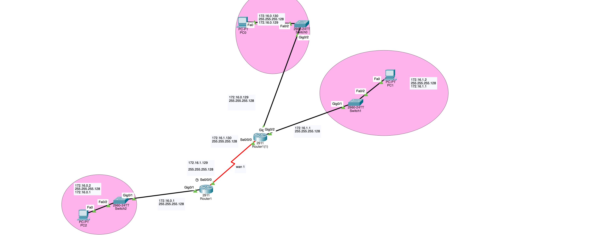

# Parcial Redes — Configuración de Red con FLSM

Práctica de direccionamiento IP con FLSM (Fixed Length Subnet Masking) sobre la red `172.16.0.0/24`, dividida en 4 subredes `/25` (`255.255.255.128`). Dos routers, tres switches y tres PCs, sin enrutamiento (solo conectividad básica y configuración inicial de dispositivos).

## Topología



```
PC2 -- SW3 -- R2 (Router1) === WAN === R1CENTRAL (Router1(1)) -- SW1 -- PC1
                                              |
                                             SW2
                                              |
                                             PC3
```

## Tabla de direccionamiento (FLSM)

| # | Red | Máscara | Rango útil | Broadcast | Uso |
|---|-----|---------|-----------|-----------|-----|
| 1 | 172.16.0.0 | /25 (255.255.255.128) | .1 – .126 | .127 | LAN R2 – PC2 |
| 2 | 172.16.0.128 | /25 (255.255.255.128) | .129 – .254 | .255 | LAN R1CENTRAL – PC3 |
| 3 | 172.16.1.0 | /25 (255.255.255.128) | .1 – .126 | .127 | LAN R1CENTRAL – PC1 |
| 4 | 172.16.1.128 | /25 (255.255.255.128) | .129 – .254 | .255 | WAN entre R2 y R1CENTRAL |

## Direcciones por dispositivo

| Dispositivo | Interfaz | IP | Máscara | Conecta a |
|---|---|---|---|---|
| **R2** (Router1, abajo) | Gig0/1 | 172.16.0.1 | 255.255.255.128 | SW3 |
| | Se0/0/0 (DCE) | 172.16.1.129 | 255.255.255.128 | R1CENTRAL |
| **R1CENTRAL** (Router1(1), central) | Gig0/1 | 172.16.1.1 | 255.255.255.128 | SW1 |
| | Gig0/2 | 172.16.0.129 | 255.255.255.128 | SW2 |
| | Se0/0/0 (DTE) | 172.16.1.130 | 255.255.255.128 | R2 |
| **PC2** | Fa0 | 172.16.0.2 | 255.255.255.128 | Gateway: 172.16.0.1 |
| **PC3** | Fa0 | 172.16.0.130 | 255.255.255.128 | Gateway: 172.16.0.129 |
| **PC1** | Fa0 | 172.16.1.2 | 255.255.255.128 | Gateway: 172.16.1.1 |

> El enlace serial es DCE del lado de R2 (cable rojo con reloj en el diagrama), por lo que `clock rate` solo va configurado ahí.

## Configuraciones

### R2 (Router1, abajo)

```
enable
conf t
hostname R2
enable secret cisco123
service password-encryption
banner motd $ ACCESO NO AUTORIZADO PROHIBIDO $

line console 0
 password ciscoconsole
 login
 exit

line vty 0 4
 password ciscovty
 login
 exit

interface gig0/1
 ip address 172.16.0.1 255.255.255.128
 no shutdown
 exit

interface se0/0/0
 ip address 172.16.1.129 255.255.255.128
 clock rate 64000
 no shutdown
 exit

end
write memory
```

### R1CENTRAL (Router1(1), central)

```
enable
conf t
hostname R1CENTRAL
enable secret cisco123
service password-encryption
banner motd $ ACCESO NO AUTORIZADO PROHIBIDO $

line console 0
 password ciscoconsole
 login
 exit

line vty 0 4
 password ciscovty
 login
 exit

interface gig0/1
 ip address 172.16.1.1 255.255.255.128
 no shutdown
 exit

interface gig0/2
 ip address 172.16.0.129 255.255.255.128
 no shutdown
 exit

interface se0/0/0
 ip address 172.16.1.130 255.255.255.128
 no shutdown
 exit

end
write memory
```

### SW3 (junto a R2 / PC2)

```
enable
conf t
hostname SW3
enable secret cisco123
service password-encryption
banner motd $ ACCESO NO AUTORIZADO $

line console 0
 password ciscoconsole
 login
 exit

line vty 0 15
 password ciscovty
 login
 exit

interface gigabitEthernet0/1
 description Enlace-a-R2
 no shutdown
 exit

interface fastEthernet0/2
 description PC2
 no shutdown
 exit

end
write memory
```

### SW1 (junto a R1CENTRAL / PC1)

```
enable
conf t
hostname SW1
enable secret cisco123
service password-encryption
banner motd $ ACCESO NO AUTORIZADO $

line console 0
 password ciscoconsole
 login
 exit

line vty 0 15
 password ciscovty
 login
 exit

interface gigabitEthernet0/1
 description Enlace-a-R1CENTRAL
 no shutdown
 exit

interface fastEthernet0/2
 description PC1
 no shutdown
 exit

end
write memory
```

### SW2 (junto a R1CENTRAL / PC3)

```
enable
conf t
hostname SW2
enable secret cisco123
service password-encryption
banner motd $ ACCESO NO AUTORIZADO $

line console 0
 password ciscoconsole
 login
 exit

line vty 0 15
 password ciscovty
 login
 exit

interface gigabitEthernet0/2
 description Enlace-a-R1CENTRAL
 no shutdown
 exit

interface fastEthernet0/2
 description PC3
 no shutdown
 exit

end
write memory
```

## Notas de verificación

- `clock rate` solo se configura en R2 (lado DCE). Si se pone en ambos routers da error; si no se pone en ninguno el enlace serial queda `down/down`.
- Verificar con `show cdp neighbors` en cada switch que el puerto marcado como "enlace a router" sea realmente el conectado.
- Sin enrutamiento configurado, `show ip interface brief` en cada router debe mostrar todas las interfaces `up/up`.
- Los PCs solo tendrán conectividad (ping) dentro de su misma subred: PC2 ↔ R2 sí, pero PC2 ↔ PC1 no, ya que no hay rutas configuradas entre routers.
